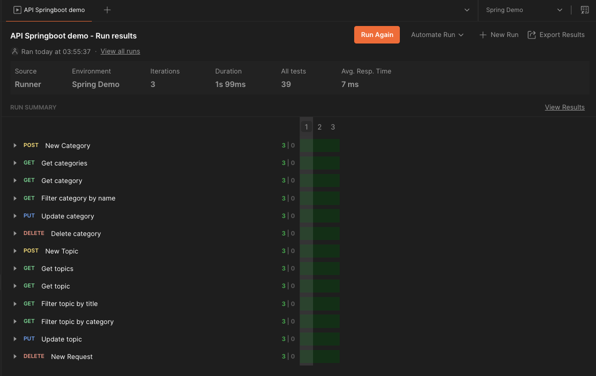

# Springboot demo

   

## Content

1. [Setup](#setup)
  - [Requisitos](#requirements)
    - [Docker](#docker)
    - [Docker Compose](#docker-compose)
    - [Clonar el repositorio y ejecutar el contenedor](#clonar-el-repositorio-y-ejecutar-el-contenedor)
    - [Notas adicionales](#notas-adicionales)
2. [🧪 Prueba con Postman](#-prueba-con-postman)
3. [Resultados de la prueba](#test-result)
4. [🚀🚀 Endpoints](#-endpoints)
  - [Category](#category)
    - [1. Get all Categories](#1-get-all-categories)
    - [2. Get Category by ID](#2-get-category-by-id)
    - [3. Search Categories by Name](#3-search-categories-by-name)
    - [4. Create Category](#4-create-category)
    - [5. Update Category](#5-update-category)
    - [6. Delete Category](#6-delete-category)
  - [Topic](#topic)
    - [1. Get all Topics](#1-get-all-topics)
    - [2. Get Topic by ID](#2-get-topic-by-id)
    - [3. Get Topics by Category ID](#3-get-topics-by-category-id)
    - [4. Search Topics by Title](#4-search-topics-by-title)
    - [5. Create Topic](#5-create-topic)
    - [6. Update Topic](#6-update-topic)
    - [7. Delete Topic](#7-delete-topic)

## Setup
Este proyecto utiliza Docker para crear una aplicación Spring Boot en un container.
A continuación, se detallan los pasos para instalar Docker, clonar el repositorio y 
ejecutar la aplicación usando `docker-compose`.

## Requirements

### Docker
Asegúrate de tener Docker instalado en tu máquina. Si no lo tienes, sigue estos pasos:

Para Windows y macOS:

1. Ve a [Docker Desktop](https://www.docker.com/products/docker-desktop/) y descarga la versión adecuada para tu sistema operativo.
2. Sigue el asistente de instalación.
3. Después de instalar Docker, abre la aplicación.

### Docker Compose
Para macOS [Docker usando brew](https://formulae.brew.sh/formula/docker-compose)
```bash
brew install docker-compose
```
### Clonar el repositorio y ejecutar el contenedor
1. Clona el repositorio de Git:
```bash 
git clone https://github.com/AddsDev/springboot-demo-campusland.git
```
```bash 
cd springboot-demo-campusland
```
2. Ejecuta los contenedores con Docker Compose:
```bash
./gradlew build
```
3. Construye y ejecuta los contenedores con Docker Compose:
```bash
docker-compose up --build
```
### Notas adicionales
Asegúrate de que el puerto expuesto en el archivo `docker-compose.yml` no esté en conflicto con otro servicio en tu máquina.


## 🧪 Prueba con Postman

Importa la `Collection` y él `Environment` a Postman.

> [Collections](postman/api_springboot_demo.postman_collection.json)

> [Environment](postman/api_springboot_demo.postman_environment.json)

## Test Result

> [Resultados - Run collection test](postman/api_pringboot_demo.postman_test_run.json)


## 🚀🚀 Endpoints

## Category

### 1\. Get all Categories

**Endpoint:** `/category`  
**Method:** `GET`  
**Description:** Retrieve a paginated list of all categories.

#### Request:

- **Parameters:**

    - `page` (optional, default 0) – Page number.

    - `size` (optional, default 20) – Number of items per page.

    - `sort` (optional) – Sort fields, e.g., `name,desc,id,asc`.

- **Response:**
```json
 {
  "content": [
    {
      "id": 16,
      "name": "3D Printing",
      "createdAt": "18.03.2024"
    },
    {
      "id": 42,
      "name": "Agriculture",
      "createdAt": "19.08.2023"
    },
    {
      "id": 57,
      "name": "AI Ethics",
      "createdAt": "02.12.2023"
    }
  ],
  "pageable": {
    "pageNumber": 0,
    "pageSize": 3,
    "sort": {
      "empty": false,
      "unsorted": false,
      "sorted": true
    },
    "offset": 0,
    "unpaged": false,
    "paged": true
  },
  "totalPages": 20,
  "totalElements": 58,
  "last": false,
  "size": 3,
  "number": 0,
  "sort": {
    "empty": false,
    "unsorted": false,
    "sorted": true
  },
  "numberOfElements": 3,
  "first": true,
  "empty": false
}
```
### 2\. Get Category by ID

**Endpoint:** `/category/{id}`  
**Method:** `GET`  
**Description:** Retrieve details of a specific category by its ID.

#### Request:

- **Parameters:**

    - `id` (Path variable) – The ID of the category.
- **Response:**
```json
 {
  "id": 59,
  "name": "Lorem HTTP",
  "createdAt": "24.01.2025"
}
```

### 3\. Search Categories by Name

**Endpoint:** `/category/search`  
**Method:** `GET`  
**Description:** Search categories by name.

#### Request:

- **Parameters:**

    - `name` (Query parameter) – The name of the category to search.

    - `page`, `size`, `sort` (optional, default as above).

- **Response:**
```json
 {
  "content": [
    {
      "id": 19,
      "name": "Biotechnology",
      "createdAt": "10.04.2024"
    },
    {
      "id": 14,
      "name": "Blockchain Technology",
      "createdAt": "05.01.2024"
    },
    {
      "id": 31,
      "name": "Green Technology",
      "createdAt": "10.03.2024"
    },
    {
      "id": 47,
      "name": "Nanotechnology",
      "createdAt": "15.04.2024"
    },
    {
      "id": 1,
      "name": "Technology",
      "createdAt": "24.01.2025"
    }
  ],
  "pageable": {
    "pageNumber": 0,
    "pageSize": 5,
    "sort": {
      "empty": false,
      "unsorted": false,
      "sorted": true
    },
    "offset": 0,
    "unpaged": false,
    "paged": true
  },
  "totalPages": 1,
  "totalElements": 5,
  "last": true,
  "size": 5,
  "number": 0,
  "sort": {
    "empty": false,
    "unsorted": false,
    "sorted": true
  },
  "numberOfElements": 5,
  "first": true,
  "empty": false
}
```

### 4\. Create Category

**Endpoint:** `/category`  
**Method:** `POST`  
**Description:** Create a new category.

#### Request:

- **Body:**


``` json
{
  "name": "Lorem HTTP"
}
 ```
- **Response:**
```json
 {
  "id": 59,
  "name": "Lorem HTTP",
  "createdAt": "24.01.2025"
}
```

### 5\. Update Category

**Endpoint:** `/category/{id}`  
**Method:** `PUT`  
**Description:** Update an existing category by ID.

#### Request:

- **Parameters:**

    - `id` (Path variable) – The ID of the category to update.

- **Body:**


``` json
{
  "name": "New categor Update SMS"
}
 ```

- **Response:**
```json
 {
  "id": 59,
  "name": "New categor Update SMS",
  "createdAt": "24.01.2025"
}
```

### 6\. Delete Category

**Endpoint:** `/category/{id}`  
**Method:** `DELETE`  
**Description:** Delete a category by ID.

#### Request:

- **Parameters:**

    - `id` (Path variable) – The ID of the category to delete.

- **Response:**
```json
 {
  "id": 59,
  "name": "New categor Update SMS",
  "createdAt": "24.01.2025"
}
```

## Topic

### 1\. Get all Topics

**Endpoint:** `/topic`  
**Method:** `GET`  
**Description:** Retrieve a paginated list of all topics.

#### Request:

- **Parameters:**

    - `page`, `size`, `sort` (optional, default as above).

- **Response:**
```json
 {
  "content": [
    {
      "id": 5,
      "title": "World Cup 2023 Highlights",
      "description": "Top moments from the 2023 World Cup.",
      "rating": 4.6,
      "views": 2000,
      "category": {
        "id": 5,
        "name": "Sports",
        "createdAt": "24.01.2025"
      },
      "createdAt": "24.01.2025"
    },
    {
      "id": 6,
      "title": "Top 10 Movies of 2024",
      "description": "A list of must-watch movies this year.",
      "rating": 4.2,
      "views": 1500,
      "category": {
        "id": 6,
        "name": "Entertainment",
        "createdAt": "24.01.2025"
      },
      "createdAt": "24.01.2025"
    },
    {
      "id": 1,
      "title": "AI Revolution",
      "description": "Discussion on how AI is transforming industries.",
      "rating": 4.8,
      "views": 1250,
      "category": {
        "id": 1,
        "name": "Technology",
        "createdAt": "24.01.2025"
      },
      "createdAt": "24.01.2025"
    }
  ],
  "pageable": {
    "pageNumber": 0,
    "pageSize": 3,
    "sort": {
      "empty": false,
      "unsorted": false,
      "sorted": true
    },
    "offset": 0,
    "unpaged": false,
    "paged": true
  },
  "totalPages": 4,
  "totalElements": 11,
  "last": false,
  "size": 3,
  "number": 0,
  "sort": {
    "empty": false,
    "unsorted": false,
    "sorted": true
  },
  "numberOfElements": 3,
  "first": true,
  "empty": false
}
```

### 2\. Get Topic by ID

**Endpoint:** `/topic/{id}`  
**Method:** `GET`  
**Description:** Retrieve details of a specific topic by its ID.

#### Request:

- **Parameters:**

    - `id` (Path variable) – The ID of the topic.

- **Response:**
```json
 {
  "id": 11,
  "title": "Lorem Ipsum",
  "description": "Lorem Ipsum es simplemente el texto de relleno de las imprentas y archivos de texto. Lorem Ipsum ha sido el texto de relleno estándar de las industrias desde el año 1500",
  "rating": 2.3,
  "views": 671,
  "category": {
    "id": 2,
    "name": "Health",
    "createdAt": "24.01.2025"
  },
  "createdAt": "24.01.2025"
}
```

### 3\. Get Topics by Category ID

**Endpoint:** `/topic/category/{id}`  
**Method:** `GET`  
**Description:** Retrieve a list of topics belonging to a specific category.

#### Request:

- **Parameters:**

    - `id` (Path variable) – The ID of the category.

- **Response:**
```json
 {
  "content": [
    {
      "id": 2,
      "title": "Mental Health Awareness",
      "description": "Resources and tips to manage mental health.",
      "rating": 4.5,
      "views": 980,
      "category": {
        "id": 2,
        "name": "Health",
        "createdAt": "24.01.2025"
      },
      "createdAt": "24.01.2025"
    },
    {
      "id": 11,
      "title": "Lorem Ipsum",
      "description": "Lorem Ipsum es simplemente el texto de relleno de las imprentas y archivos de texto. Lorem Ipsum ha sido el texto de relleno estándar de las industrias desde el año 1500",
      "rating": 2.3,
      "views": 671,
      "category": {
        "id": 2,
        "name": "Health",
        "createdAt": "24.01.2025"
      },
      "createdAt": "24.01.2025"
    }
  ],
  "pageable": {
    "pageNumber": 0,
    "pageSize": 5,
    "sort": {
      "empty": false,
      "unsorted": false,
      "sorted": true
    },
    "offset": 0,
    "unpaged": false,
    "paged": true
  },
  "totalPages": 1,
  "totalElements": 2,
  "last": true,
  "size": 5,
  "number": 0,
  "sort": {
    "empty": false,
    "unsorted": false,
    "sorted": true
  },
  "numberOfElements": 2,
  "first": true,
  "empty": false
}
```

### 4\. Search Topics by Title

**Endpoint:** `/topic/search`  
**Method:** `GET`  
**Description:** Search topics by title.

#### Request:

- **Parameters:**

    - `title` (Query parameter) – The title to search for.

    - `page`, `size`, `sort` (optional, default as above).
- **Response:**
```json
 {
  "content": [
    {
      "id": 1,
      "title": "AI Revolution",
      "description": "Discussion on how AI is transforming industries.",
      "rating": 4.8,
      "views": 1250,
      "category": {
        "id": 1,
        "name": "Technology",
        "createdAt": "24.01.2025"
      },
      "createdAt": "24.01.2025"
    }
  ],
  "pageable": {
    "pageNumber": 0,
    "pageSize": 50,
    "sort": {
      "empty": false,
      "unsorted": false,
      "sorted": true
    },
    "offset": 0,
    "unpaged": false,
    "paged": true
  },
  "totalPages": 1,
  "totalElements": 1,
  "last": true,
  "size": 50,
  "number": 0,
  "sort": {
    "empty": false,
    "unsorted": false,
    "sorted": true
  },
  "numberOfElements": 1,
  "first": true,
  "empty": false
}
```

### 5\. Create Topic

**Endpoint:** `/topic`  
**Method:** `POST`  
**Description:** Create a new topic.

#### Request:

- **Body:**


``` json
{
  "title": "Lorem Ipsum",
  "categoryId": 2
}
 ```

- **Response:**
```json
 {
  "id": 11,
  "title": "Lorem Ipsum",
  "description": "Lorem Ipsum es simplemente el texto de relleno de las imprentas y archivos de texto. Lorem Ipsum ha sido el texto de relleno estándar de las industrias desde el año 1500",
  "rating": 2.3,
  "views": 671,
  "category": {
    "id": 2,
    "name": "Health",
    "createdAt": "24.01.2025"
  },
  "createdAt": "24.01.2025"
}
```

### 6\. Update Topic

**Endpoint:** `/topic/{id}`  
**Method:** `PUT`  
**Description:** Update an existing topic by ID.

#### Request:

- **Parameters:**

    - `id` (Path variable) – The ID of the topic to update.

- **Body:**


``` json
{
  "title": "Lorem Ipsum update"
}

 ```

- **Response:**
```json
 {
  "id": 11,
  "title": "Lorem Ipsum update",
  "description": "Lorem Ipsum es simplemente el texto de relleno de las imprentas y archivos de texto. Lorem Ipsum ha sido el texto de relleno estándar de las industrias desde el año 1500.",
  "rating": 4.3,
  "views": 699,
  "category": {
    "id": 1,
    "name": "Technology",
    "createdAt": "24.01.2025"
  },
  "createdAt": "24.01.2025"
}
```

### 7\. Delete Topic

**Endpoint:** `/topic/{id}`  
**Method:** `DELETE`  
**Description:** Delete a topic by ID.

#### Request:

- **Parameters:**

    - `id` (Path variable) – The ID of the topic to delete.

- **Response:**
```json
 {
  "id": 11,
  "title": "Lorem Ipsum update",
  "description": "Lorem Ipsum es simplemente el texto de relleno de las imprentas y archivos de texto. Lorem Ipsum ha sido el texto de relleno estándar de las industrias desde el año 1500.",
  "rating": 4.3,
  "views": 699,
  "category": {
    "id": 1,
    "name": "Technology",
    "createdAt": "24.01.2025"
  },
  "createdAt": "24.01.2025"
}
```

### 📝 Autor

Este proyecto fue creado [AddsDev](https://github.com/AddsDev).  
Distribuido bajo la licencia Apache. © 2025 [AddsDev](https://github.com/AddsDev).